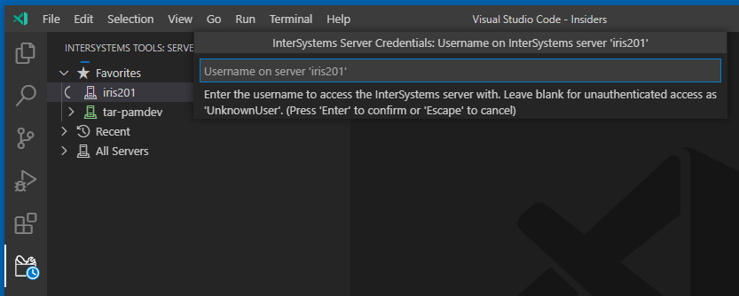
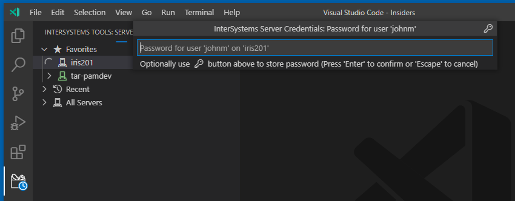
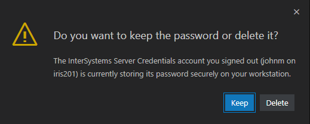

# InterSystems Server Manager

> **Note:** The best way to install and use this extension is by installing the [InterSystems ObjectScript Extension Pack](https://marketplace.visualstudio.com/items?itemName=intersystems-community.objectscript-pack) and following the [documentation here](https://docs.intersystems.com/components/csp/docbook/DocBook.UI.Page.cls?KEY=GVSCO).

InterSystems Server Manager is a Visual Studio Code extension for defining connections to [InterSystems](https://www.intersystems.com/) servers. These definitions can used by other VS Code extensions when they make connections. One example is the [ObjectScript extension](https://github.com/intersystems-community/vscode-objectscript) for code editing. The [Launch WebTerminals](https://marketplace.visualstudio.com/items?itemName=georgejames.webterminal-vscode) extension is another.

See the [CHANGELOG](https://marketplace.visualstudio.com/items/intersystems-community.servermanager/changelog) for changes in each release.

# New in Version 3.8 - November 2024
- Updated the authentication provider to resolve overprompting caused by a VS Code 1.93 change.
- Added a new function (`getAccount`) to the API surface as a helper for extensions leveraging the authentication provider.

# New in Version 3.6 - January 2024
The view container was renamed and given a new icon as part of work integrating the ObjectScript extension's views with it.

# New in Version 3.4 - July 2023

- The sequence of prompts displayed when creating a new server definition now includes one where you can optionally enter the `pathPrefix` that is necessary when a single web server is providing REST connectivity to multiple InterSystems servers.

- A new "Web Applications" tree within each namespace node provides a convenient way to create a workspace folder in which to edit web application files.

> We have removed support for version 2's password storage mechanism. If you have been using the `"intersystemsServerManager.authentication.provider": "none"` setting this will no longer have any effect and your connections will behave as though no passwords have been stored. You can migrate stored passwords by downgrading to Server Manager 3.2 and running the `Migrate Passwords` command.
> 
>  VS Code 1.82 (August 2023) is scheduled to drop support for the keytar package used by the v2 mechanism, so you should perform v2 password migration before upgrading to that version.

# New in Version 3.2 - October 2022

We are pleased to publish version 3.2 of this extension. This replaces version 2, improving the security of stored passwords by integrating with VS Code's [Authentication Provider API](https://code.visualstudio.com/api/references/vscode-api#AuthenticationProvider). Version 3 was originally created for the [November 2021 InterSystems Security Contest](https://openexchange.intersystems.com/contest/19).

Thanks to [George James Software](https://georgejames.com) for backing this development effort.

## The Authentication Provider

Server Manager implements an authentication provider called 'intersystems-server-credentials', and uses this authentication provider when accessing servers from its own [Server Tree](#the-server-tree).

### Signing In

The first time you expand a server in the tree VS Code displays a modal dialog asking for your permission:


If you allow this and your server definition in `intersystems.servers` does not specify a `username` the next step is:



If you proceed, or if this step was skipped because your server definition includes a username, the next step is:



By clicking the 'key' button at the upper right corner of the dialog after typing your password you can save it securely in your workstation's operating system keychain, from where the 'InterSystems Server Credentials' authentication provider will be able to retrieve it after you restart VS Code.

If instead you press 'Enter' the password will be available only until you restart VS Code.

Either way, you are now signed in on the specified account.

### Trusting Other Extensions

When another extension first asks to use an InterSystems Server Credentials account you must either allow this or deny it. For example, when the InterSystems ObjectScript extension uses the new authentication provider you get this dialog after you click the edit pencil button alongside a namespace in the [Server Manager tree](#the-server-tree):


### Managing Signed In Accounts

You can use the menu of VS Code's Accounts icon in the activity bar to manage your signed-in accounts:


The 'Manage Trusted Extensions' option lets you remove an extension from the list of those you previously granted access to this InterSystems Server Credentials account:


The 'Sign Out' option lets you sign out this account after confirmation:


When signing out an account for which you previously saved the password you will get an option to delete the password, unless you have altered the `intersystemsServerManager.credentialsProvider.deletePasswordOnSignout` setting:



---

# New in Version 2 - April 2021

The following features were originally introduced in Server Manager version 2.

## The Server Tree

Server Manager displays connection definitions as a tree on an InterSystems Tools view:


In this tree you can:

- Launch the InterSystems Management Portal, either in a VS Code tab or in your default browser.
- List namespaces.
- Add namespaces to your VS Code workspace for viewing or editing source code on the server, including web application (formerly CSP) files, with the [ObjectScript extension](https://github.com/intersystems-community/vscode-objectscript).
- Tag favorite servers.
- Set icon colors.
- Focus on recently used connections.
- Add new servers, and edit existing ones.

In common with the rest of VS Code, Server Manager stores your connection settings in JSON files. VS Code settings are arranged in a hierarchy that you can learn more about [here](https://code.visualstudio.com/docs/getstarted/settings).

Server Manager can store connection passwords in the native keystore of your workstation's operating system. This is a more secure alternative to you putting them as plaintext in your JSON files.

On Windows, Server Manager can create connection entries for all connections you previously defined with the original Windows app called InterSystems Server Manager. This action is available from the '`...`' menu at the top right corner of Server Manager's tree.

## Defining a New Server

1. Click the '`+`' button on Server Manager's title bar.
2. Complete the sequence of prompts.
3. Expand `All Servers` to see your new entry in the tree.

The server definition is added to your [user-level](https://code.visualstudio.com/docs/getstarted/settings) `settings.json` file and also appears at the top of the 'Recent' folder.

Optionally use its context menu to set the color of the server icon.

The 'star' button that appears when you hover over the row lets you add the server to the `Favorites` list at the top of the tree.

## Viewing and Editing Source Code

1. Expand the target server, then expand its 'Namespaces' folder.
2. Hover over the target namespace to reveal its command buttons.
3. Click the 'edit pencil' icon to add an `isfs://server:namespace/` folder to your VS Code workspace, or use the 'viewing eye' icon to add an `isfs-readonly://server:namespace/` one.
4. To add a folder that gives you access to server-side web application files (for example, CSP files), hold the <kbd>Alt</kbd> / <kbd>Option</kbd> key down as you click the button for the type of access you want.

Learn more about `isfs` and `isfs-readonly` folders in the [documentation](https://docs.intersystems.com/components/csp/docbook/DocBook.UI.Page.cls?KEY=GVSCO_ssworkflow).

> If you are already doing client-side editing of your code (for example, managing it with Git), be sure you understand the consequences of also doing server-side editing using `isfs`. The [documentation](https://docs.intersystems.com/components/csp/docbook/DocBook.UI.Page.cls?KEY=GVSCO_intro) outlines the differences between client-side and server-side editing. If in doubt, limit yourself to `isfs-readonly` by only using the eye icon.

## The 'Current' Folder

When you have a folder or a workspace (including a multi-root one) open in VS Code, Server Manager displays a 'Current' node at the start of its tree if your workspace references any server defined in Server Manager. The linking happens automatically if you added workspace folders from Server Manager as described above. If you are using the client-side mode of working, your `objectscript.conn` setting needs to use the `server` property.

## Launching Management Portal

When you hover over a server entry in the tree two command buttons let you launch InterSystems Management Portal.

The first button uses VS Code's Simple Browser feature, which creates a tab alongside any documents you may have open. The second button opens Portal in your workstation's default web browser.

### Notes About Simple Browser
- There is only ever a single Simple Browser tab. Launching another server's Management Portal in it will replace the previous one.
- If the server version is InterSystems IRIS 2020.1.1 or later you will need to change a setting on the suite of web applications that implement Management Portal. This is a consequence of change [SGM031 - Support SameSite for CSP session and user cookies](https://docs.intersystems.com/iris20201/csp/docbook/relnotes/index.html#SGM031). Simple Browser will not be permitted to store Portal's session management cookies, so Portal must be willing to fall back to using the CSPCHD query parameter mechanism.
    -  Locate the five web applications whose path begins with `/csp/sys`
	

	- Alter the `Use Cookie for Session` setting on each of them so it is `Autodetect` instead of `Always`.
	
	Remember to save the change. The change is not thought to have any adverse effects on the usage of Portal from ordinary browsers, which will continue to use session cookies.
- When a 2020.1.1+ Portal has resorted to using CSPCHD (see above) a few inter-page links fail because they don't add the CSPCHD queryparam. One specific case is the breadcrumb links. Pending the arrival of an InterSystems correction (JIRA DP-404817) these links will take you to the login page. Either enter your credentials to proceed, or launch Simple Browser again from the Server Manager tree.

## Amending and Removing Servers

To manage your server definitions, including changing the username it connects with, [edit the relevant JSON file](https://code.visualstudio.com/docs/getstarted/settings).

1. From a server's context menu, or from Server Manager's top-right '`...`' menu, choose `Edit Settings`. This opens VS Code's Settings Editor and filters its contents.


2. Click the `Edit in settings.json` link.

In this example two connections have been defined:

```json
"intersystems.servers": {
	"dev": {
		"webServer": {
			"scheme": "https",
			"host": "webhost.local",
			"port": 443,
			"pathPrefix": "/iris/dev"
		},
		"username": "alice",
		"description": "Development server serviced by central web host over HTTPS"
	},
	"my-local": {
		"webServer": {
			"scheme": "http",
			"host": "127.0.0.1",
			"port": 52773
		},
		"description": "My local IRIS instance"
	},
	"/default": "my-local"
}
```

The JSON editor offers the usual [IntelliSense](https://code.visualstudio.com/docs/editor/intellisense) as you work in this structure.

Notice how you can add a `description` property to each connection. This will be shown in the hover in Server Manager's tree, and alongside the entry if a server quickpick is used.

Servers are displayed in the quickpick in the order they are defined in the JSON file. The exception is that if a server name is set as the value of the `/default` property (see example above) it will be shown first in the list.

---

## Technical Notes

### Colors, Favorites and Recents

These features use VS Code's extension-private global state storage. Data is not present in your `settings.json` file.

### The 'All Servers' Folder

The `All Servers` tree respects the optional `/default` setting in the `intersystems.servers` JSON.

If a server has been named in `/default` it is promoted to the top of the list, which is otherwise presented in alphabetical order.

---

## Information for VS Code Extension Developers - How To Leverage Server Manager

The NPM package [`@intersystems-community/intersystems-servermanager`](https://www.npmjs.com/package/@intersystems-community/intersystems-servermanager) defines the types used by the API which this extension exports. It also declares some constants.

An extension XYZ needing to connect to InterSystems servers should include `"@intersystems-community/intersystems-servermanager": "^3.8.0"` in the `"devDependencies"` object in its `package.json`.

It might also define Server Manager as a dependency in its `package.json` like this:

```json
  "extensionDependencies": [
    "intersystems-community.servermanager"
  ],
```

Alternatively the `activate` method of XYZ can detect whether the extension is already available, then offer to install it if not:

```ts
  import * as serverManager from '@intersystems-community/intersystems-servermanager';
```
...
```ts
  let extension = vscode.extensions.getExtension(serverManager.EXTENSION_ID);
  if (!extension) {
	// Optionally ask user for permission
	// ...

	await vscode.commands.executeCommand('workbench.extensions.installExtension', serverManager.EXTENSION_ID);
	extension = vscode.extensions.getExtension(serverManager.EXTENSION_ID);
  }
  if (!extension.isActive) {
    await extension.activate();
  }
```

XYZ can then use the extension's API to obtain the properties of a named server definition:

```ts
  const serverManagerApi: serverManager.ServerManagerAPI = extension.exports;
  if (serverManagerApi && serverManagerApi.getServerSpec) { // defensive coding
	const serverSpec: serverManager.IServerSpec | undefined = await serverManagerApi.getServerSpec(serverName);
  }
```

The `username` and `password` properties will only be present if defined in the settings JSON. Storage of `password` there is deprecated and strongly discouraged.

To obtain the password with which to connect, use code like this which will also prompt for a username if absent:

```ts
  if (typeof serverSpec.password === 'undefined') {
    const scopes = [serverSpec.name, serverSpec.username || ''];
	const account = serverManagerApi.getAccount(serverSpec);
    let session = await vscode.authentication.getSession(serverManager.AUTHENTICATION_PROVIDER, scopes, { silent: true, account });
    if (!session) {
      session = await vscode.authentication.getSession(serverManager.AUTHENTICATION_PROVIDER, scopes, { createIfNone: true, account });
    }
    if (session) {
      serverSpec.username = session.scopes[1];
      serverSpec.password = session.accessToken;
    }
  }
```

To offer the user a quickpick of servers:

```ts
  const serverName: string = await serverManagerApi.pickServer();
```

To obtain an array of server names:

```ts
  const allServerNames: serverManager.IServerName[] = await serverManagerApi.getServerNames();
```
For up-to-date details of the API, including result types and available parameters, review the source code of the extension's `activate` method [here](https://github.com/intersystems-community/intersystems-servermanager/blob/master/src/extension.ts).

---
<div>Activity Bar icon made by <a href="https://www.freepik.com" title="Freepik">Freepik</a> from <a href="https://www.flaticon.com/" title="Flaticon">www.flaticon.com</a></div>
